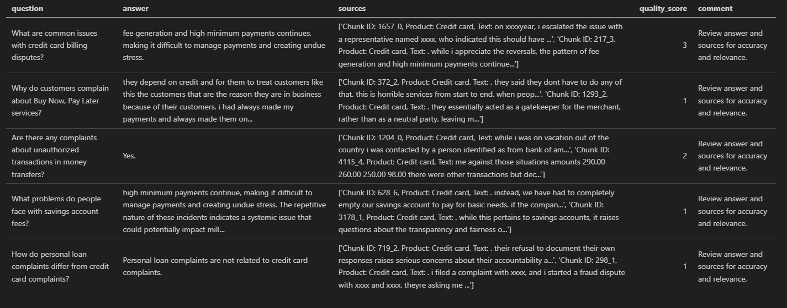
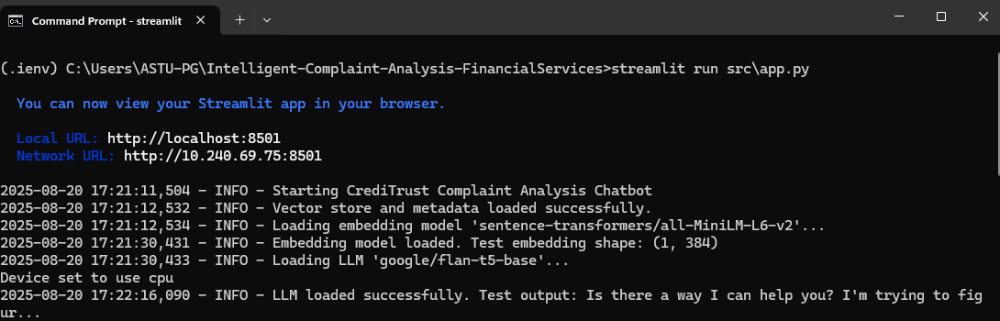
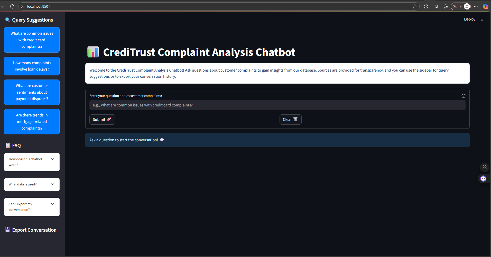
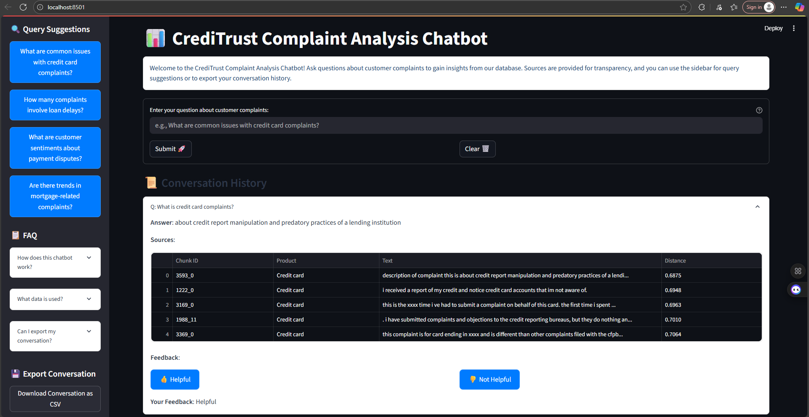

    

# Intelligent Complaint Analysis for Financial Services

## Building a RAG-Powered Chatbot to Turn Customer Feedback into Actionable Insights

> ### Author Tegbabu S. Nuramo

## Task-1: Exploratory Data Analysis and Data Preprocessing

#### EDA and Preprocessing Findings

✅ The exploratory data analysis of the CFPB complaint dataset reveals key insights into its structure and content.The dataset contains a diverse set of complaints across multiple financial products, with the initial analysis showing the distribution of complaints across products, highlighting which financial products (e.g., Credit card, Personal loan) receive the most complaints.

✅ The narrative length analysis indicates a wide range of complaint lengths, with some narratives being very short (<10 words) and others excessively long (>500 words), suggesting variability in consumer detail.

✅ Complaints without narratives were identified, and these were excluded from the final dataset to ensure quality for the RAG pipeline.

✅ After filtering for the specified products (Credit card, Personal loan, Buy Now, Pay Later, Savings account, Money transfers) and removing records with empty narratives, the dataset was significantly reduced in size, ensuring relevance and usability.

✅ Text cleaning involved lowercasing, removing special characters, and eliminating common boilerplate phrases to improve embedding quality.

✅ The cleaned dataset, saved as **filtered_complaints.csv**, retains essential metadata and cleaned narratives, making it suitable for downstream tasks like embedding and retrieval.

✅ The preprocessing steps ensure that the narratives are standardized and free of noise, enhancing the performance of the chatbot in answering queries based on real-world feedback.

## Task-2 Text Chunking, Embedding, and Vector Store Indexing

#### Report Section: Chunking Strategy and Embedding Model Choice

✅ For the text chunking strategy, I utilized LangChain's RecursiveCharacterTextSplitter with a chunk_size of 500 characters and a chunk_overlap of 50 characters.

✅ The chunk size was chosen to balance capturing coherent segments of complaint narratives (approximately 100-150 words) while ensuring embeddings remain semantically meaningful. Complaints often contain distinct issues (e.g., billing disputes, customer service issues), and smaller chunks help isolate these for better retrieval precision.

✅ The overlap of 50 characters maintains context across chunk boundaries, especially for narratives split mid-sentence. I experimented with larger chunk sizes (e.g., 1000 characters), but they risked diluting specific issues in longer narratives, while smaller chunks (e.g., 200 characters) fragmented context excessively. The chosen parameters were validated by inspecting sample chunks, ensuring they retained meaningful complaint details.

✅ The sentence-transformers/all-MiniLM-L6-v2 model was selected for embedding due to its efficiency and performance in semantic similarity tasks. This lightweight model (22M parameters, 384-dimensional embeddings) is optimized for short text, making it ideal for complaint narratives, which are typically concise yet descriptive. It provides a good balance between embedding quality and computational efficiency, suitable for indexing large datasets like the CFPB complaints. The model’s pre-training on diverse datasets ensures robust handling of financial terminology and consumer language.

✅ FAISS was chosen for the vector store due to its speed and scalability for similarity search, with metadata (complaint ID, product, chunk ID) stored alongside each embedding to enable traceability to the original complaint. The vector store and metadata are persisted in the vector_store/ directory for downstream retrieval tasks.

## Task 3: Building the RAG Core Logic and Evaluation

### Deliverables

    1. Python Module (rag_pipeline.py): 
     - The script successfully produced the evaluation table
    2. Evaluation Table (evaluation_table.md)
     - The table (provided in the document) contains answers and sources for five questions, with a quality score  
       and a comment to “Review answer and sources for accuracy and relevance.”

Evaluation table is follows

## Task 4: Creating an Interactive Chat Interface
✅ The Streamlit application (app.py) provides an intuitive interface for users to interact with the RAG pipeline, enabling queries about customer complaints at CrediTrust.

✅ It is Built with Streamlit, it features a text input, “Submit” and “Clear” buttons, and displays AI-generated answers with source chunks for transparency. 

✅ The interface integrates the Task 3 pipeline (flan-base, sentence-transformers/all-MiniLM-L6-v2, FAISS vector store) and addresses usability and trust requirements.

#### When the streamlit app starts on cmd it looks the following.
  

#### Then it will open the localhost:8501 on the default browser

#### When prompted with questions it looks as follows

## DEMO for 📊 CrediTrust Complaint Analysis Chatbot

### How to run the application
    streamlit run src\app.py

Then it will smoothly run as follows demo:

## Project Structure

<pre>
Intelligent-Complaint-Analysis-Financial Services/
├── .github/workflows/ci.yml   # For CI/CD
├── data/                       # add this folder to .gitignore
│   ├── raw/                   # Raw data goes here
|   |       └── complaints.csv
│   └── processed/             # Processed data for training
├── images/        # include images of screen shot or gifs 
├── logs/
|      └── app.log      # log file for the system
├── vectore_store/
|   ├── sample_chunks.csv    # Sample chunks for verification
|   ├── metadata.pkl         # chunks metadata
|   ├── faiss_index.faiss         # chunks metadata
|   └── faiss_index.bin      # FAISS index
├── models/                  # Saved embedding model
├── notebooks/
|   ├── logs/
|   |       └──  app.log     # logs
|   ├── README.md
|   ├── RAG-pipeline.ipynb    # rag pipeline
|   ├── text_chunk.ipynb     # text chunker pipeline
│   └── complaints-EDA.ipynb          # Exploratory, one-off analysis
├── src/
│   ├── __init__.py
│   ├── data_process.py     # Script for Data Processing (EDA)
│   └── loggers.py    # logging to the files and output
├── tests/
|   ├── __init__.py
|   ├── test_app.py     # test files for the streamlit interface
|   ├── test_text_chunker.py # test files for text chuncker
|   ├── test_retrieval_rag.py  # test files for the rag_pipeline
|   ├── test_data_process.py   # test files for the data_process
│   └── test_sample.py         # Unit tests
├── requirements.txt
├── .gitignore
├── LICENSE
└── README.md
</pre>

## Getting Started

Clone the repository

`git clone http://github.com/tegbiye/Intelligent-Complaint-Analysis-FinancialServices.git`

`cd Intelligent-Complaint-Analysis-FinancialServices`

Create environment using venv

`python -m venv .venv`

Activate the environment

`.venv\Scripts\activate` (Windows)

`source .venv\bin\activate` (Linux / Mac)

Install Dependencies

`pip install -r requirements.txt`

📜 License This project is licensed under the MIT License. Feel free to use, modify, and distribute with proper attribution.
